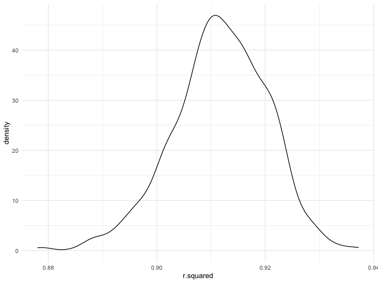
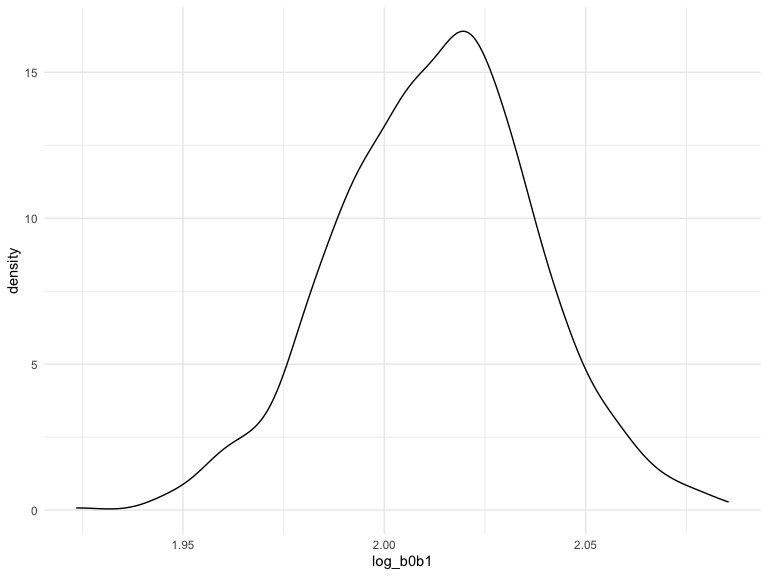
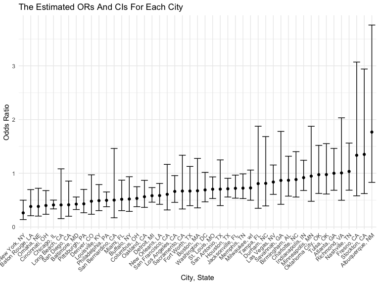
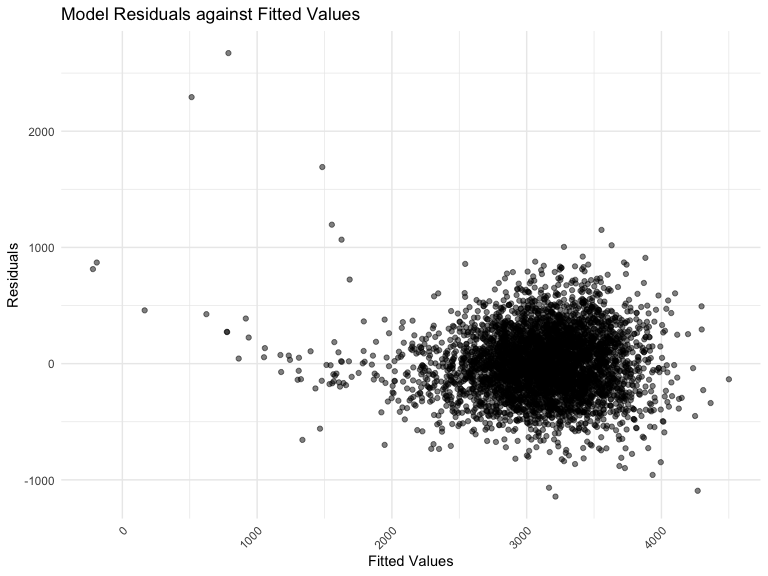

p8105_hw6_yy3296
================
Yuze Yuan
2022-12-03

# Problem 1

To obtain a distribution for $\hat{r}^2$, we’ll follow basically the
same procedure we used for regression coefficients: draw bootstrap
samples; the a model to each; extract the value I’m concerned with; and
summarize. Here, we’ll use `modelr::bootstrap` to draw the samples and
`broom::glance` to produce `r.squared` values.

``` r
weather_df = 
  rnoaa::meteo_pull_monitors(
    c("USW00094728"),
    var = c("PRCP", "TMIN", "TMAX"), 
    date_min = "2017-01-01",
    date_max = "2017-12-31") %>%
  mutate(
    name = recode(id, USW00094728 = "CentralPark_NY"),
    tmin = tmin / 10,
    tmax = tmax / 10) %>%
  select(name, id, everything())
```

    ## Registered S3 method overwritten by 'hoardr':
    ##   method           from
    ##   print.cache_info httr

    ## file min/max dates: 1869-01-01 / 2022-12-31

``` r
weather_df %>% 
  modelr::bootstrap(n = 1000) %>% 
  mutate(
    models = map(strap, ~lm(tmax ~ tmin, data = .x) ),
    results = map(models, broom::glance)) %>% 
  select(-strap, -models) %>% 
  unnest(results) %>% 
  ggplot(aes(x = r.squared)) + geom_density()
```



In this example, the $\hat{r}^2$ value is high, and the upper bound at 1
may be a cause for the generally skewed shape of the distribution. If we
wanted to construct a confidence interval for $R^2$, we could take the
2.5% and 97.5% quantiles of the estimates across bootstrap samples.
However, because the shape isn’t symmetric, using the mean +/- 1.96
times the standard error probably wouldn’t work well.

We can produce a distribution for $\log(\beta_0 * \beta1)$ using a
similar approach, with a bit more wrangling before we make our plot.

``` r
weather_df %>% 
  modelr::bootstrap(n = 1000) %>% 
  mutate(
    models = map(strap, ~lm(tmax ~ tmin, data = .x) ),
    results = map(models, broom::tidy)) %>% 
  select(-strap, -models) %>% 
  unnest(results) %>% 
  select(id = `.id`, term, estimate) %>% 
  pivot_wider(
    names_from = term, 
    values_from = estimate) %>% 
  rename(beta0 = `(Intercept)`, beta1 = tmin) %>% 
  mutate(log_b0b1 = log(beta0 * beta1)) %>% 
  ggplot(aes(x = log_b0b1)) + geom_density()
```



As with $r^2$, this distribution is somewhat skewed and has some
outliers.

The point of this is not to say you should always use the bootstrap –
it’s possible to establish “large sample” distributions for strange
parameters / values / summaries in a lot of cases, and those are great
to have. But it is helpful to know that there’s a way to do inference
even in tough cases.

# Problem 2

I import the data

``` r
homecide_raw = read_csv("./data/homicide-data.csv")
```

    ## Rows: 52179 Columns: 12
    ## ── Column specification ────────────────────────────────────────────────────────
    ## Delimiter: ","
    ## chr (9): uid, victim_last, victim_first, victim_race, victim_age, victim_sex...
    ## dbl (3): reported_date, lat, lon
    ## 
    ## ℹ Use `spec()` to retrieve the full column specification for this data.
    ## ℹ Specify the column types or set `show_col_types = FALSE` to quiet this message.

I create a city_state variable, and the format of this variable is
“City, State”. Then, I make a binary variable indicating whether the
homicide is solved. In addition, I Omit cities Dallas, TX; Phoenix, AZ;
and Kansas City, MO, and Tulsa, AL, and make victim_age numeric. For
this problem, limit my analysis those for whom victim_race is white or
black.

``` r
homecide_clean = 
  homecide_raw %>%
  janitor::clean_names() %>%
  mutate(city_state = str_c(city, ", ", state),
         whether_hom_solved = ifelse(str_detect(disposition, 'Closed by arrest'), 1, 0),
         victim_age = as.numeric(victim_age)) %>%
  filter(!city_state %in% c("Dallas, TX", "Phoenix, AZ","Kansas City, MO","Tulsa, AL"),
         victim_race %in% c("White","Black")) 
```

For the city of Baltimore, MD, I use the glm function to fit a logistic
regression with resolved vs unresolved as the outcome and victim age,
sex and race as predictors, and save the output of glm as an R object;
Then, I apply the broom::tidy to this object. Besides, I obtain the
estimate and confidence interval of the adjusted odds ratio for solving
homicides comparing male victims to female victims keeping all other
variables fixed.

``` r
homecide_clean_Bal = 
  homecide_clean %>% 
  filter(city_state == "Baltimore, MD") 
homecide_clean_Ballog = 
  homecide_clean_Bal %>%
  glm(whether_hom_solved ~ victim_age + victim_race + victim_sex, data = ., family = binomial()) %>%
  broom::tidy() %>%
  mutate(OR = exp(estimate),
         ci_lower = exp(estimate - 1.96*std.error),
         ci_upper = exp(estimate + 1.96*std.error)) %>% 
  select(term, OR, ci_lower, ci_upper) %>% 
  knitr::kable(digits = 3)
```

Now run glm for each of the cities in the dataset, and extract the
adjusted odds ratio (and CI) for solving homicides comparing male
victims to female victims. I do this within a “tidy” pipeline, making
use of purrr::map, list columns, and unnest as necessary to create a
dataframe with estimated ORs and CIs for each city.

``` r
Each_citylog = 
  homecide_clean %>% 
  nest(data = -city_state) %>% 
  mutate(
    models = map(data, ~glm(whether_hom_solved ~ victim_age + victim_race + victim_sex, data = .x, family = binomial())), 
    result = map(models, broom::tidy))%>% 
  select(-data, -models) %>%
  unnest(result) %>%
  mutate(
    OR = exp(estimate),
    ci_lower = exp(estimate - 1.96*std.error),
    ci_upper = exp(estimate + 1.96*std.error)) %>%
  filter(term == "victim_sexMale") %>%
  select(city_state, term, OR, ci_lower, ci_upper)
```

I create a plot that shows the estimated ORs and CIs for each city.
Organize cities according to estimated OR, and comment on the plot.

``` r
Each_citylog %>% 
  mutate(city_state = fct_reorder(city_state, OR)) %>% 
  ggplot(aes(x = city_state, y = OR)) + 
  geom_point() +
  geom_errorbar(aes(ymin = ci_lower, ymax = ci_upper)) +
  theme(axis.text.x = element_text(angle = 45, hjust = 1)) +
  labs(
    title = "The Estimated ORs And CIs For Each City",
    x = "City, State",
    y = "Odds Ratio"
  )
```



# Problem 3

I import the data

``` r
birthweight = read_csv("./data/birthweight.csv")
```

    ## Rows: 4342 Columns: 20
    ## ── Column specification ────────────────────────────────────────────────────────
    ## Delimiter: ","
    ## dbl (20): babysex, bhead, blength, bwt, delwt, fincome, frace, gaweeks, malf...
    ## 
    ## ℹ Use `spec()` to retrieve the full column specification for this data.
    ## ℹ Specify the column types or set `show_col_types = FALSE` to quiet this message.

I clean the data for regression analysis including converting numeric to
factor where appropriate, checking for missing data, etc .

``` r
birthweight_clean = 
  birthweight %>%
  janitor::clean_names() %>%
  mutate(
    babysex = as.factor(babysex),
    babysex = fct_recode(babysex, "male" = "1", "female" = "2"),
    frace = as.factor(frace),
    frace = fct_recode(frace, "white" = "1", "black" = "2", "asian" = "3", 
                       "puerto rican" = "4", "other" = "8"),
    malform = as.logical(malform),
    mrace = as.factor(mrace),
    mrace = fct_recode(mrace, "white" = "1", "black" = "2", "asian" = "3", 
                       "puerto rican" = "4")) %>% 
  drop_na()
```

Firstly, I propose a regression model for birthweight based on some
factors I guess will relavant to birthweight.

``` r
bw_reg_guess = lm(bwt ~ bhead + blength + momage + fincome + smoken, data = birthweight_clean) 
summary(bw_reg_guess)
```

    ## 
    ## Call:
    ## lm(formula = bwt ~ bhead + blength + momage + fincome + smoken, 
    ##     data = birthweight_clean)
    ## 
    ## Residuals:
    ##      Min       1Q   Median       3Q      Max 
    ## -1143.80  -188.75    -8.24   178.35  2672.10 
    ## 
    ## Coefficients:
    ##               Estimate Std. Error t value Pr(>|t|)    
    ## (Intercept) -6029.0920    96.4037 -62.540  < 2e-16 ***
    ## bhead         142.7822     3.4748  41.091  < 2e-16 ***
    ## blength        84.5113     2.0590  41.045  < 2e-16 ***
    ## momage          4.5347     1.1904   3.809 0.000141 ***
    ## fincome         1.1449     0.1779   6.436 1.36e-10 ***
    ## smoken         -1.9966     0.5915  -3.375 0.000743 ***
    ## ---
    ## Signif. codes:  0 '***' 0.001 '**' 0.01 '*' 0.05 '.' 0.1 ' ' 1
    ## 
    ## Residual standard error: 286.5 on 4336 degrees of freedom
    ## Multiple R-squared:  0.6875, Adjusted R-squared:  0.6871 
    ## F-statistic:  1908 on 5 and 4336 DF,  p-value: < 2.2e-16

By the result, we can see all these five factor are relavent for
birthweight since the significance level is less than 0.001.

I show a plot of model residuals against fitted values – use
add_predictions and add_residuals in making this plot.

``` r
birthweight_clean %>% 
  add_predictions(bw_reg_guess) %>% 
  add_residuals(bw_reg_guess) %>% 
  ggplot(aes(x = pred, y = resid)) +
  geom_point(alpha = .5) +
  theme(axis.text.x = element_text(angle = 45, hjust = 1))+
  labs(
    title = "Model Residuals against Fitted Values",
    x = "Fitted Values",
    y = "Residuals"
  )
```



Compare the model to two others:

One using length at birth and gestational age as predictors (main
effects only) One using head circumference, length, sex, and all
interactions (including the three-way interaction) between these

``` r
bw_regmodel_1 = lm(bwt ~ blength + gaweeks, data = birthweight_clean)
bw_regmodel_2 = lm(bwt ~ bhead + blength + babysex + bhead * blength + bhead * babysex + blength * babysex + bhead * blength * babysex, data = birthweight_clean)
```
